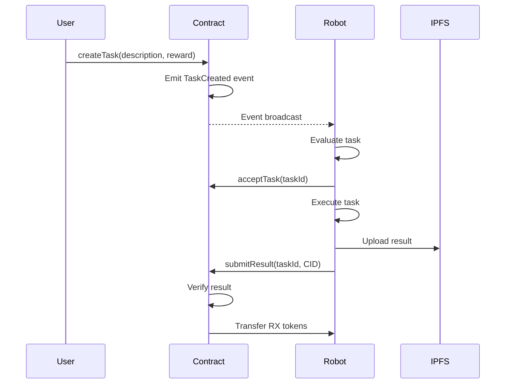

# Data Flow

Understanding how data moves through the RoboVM system is crucial for development and debugging.

## Task Execution Flow

### 1. Task Creation



## Communication Protocols

### On-Chain (Blockchain)

- **Smart Contract Events**: Task creation, acceptance, completion
- **Transactions**: Token transfers, task assignments
- **State Changes**: Reputation updates, staking

### Off-Chain

- **ROS2 Topics**: Real-time robot communication
  - `/robot/status` - Telemetry data
  - `/robot/cmd` - Command interface
  - `/task/current` - Active task information
- **IPFS**: Large data storage (maps, images, logs)
- **MQTT**: IoT sensor data streaming
- **REST API**: Dashboard and monitoring interfaces

## Data Formats

### On-Chain Task Structure

```solidity
struct Task {
    string description;
    uint256 reward;
    address creator;
    address assigned;
    bool completed;
    string resultCid;  // IPFS CID
    uint256 minStake;
    uint256 reputationReq;
}
```

### Off-Chain Result Format (IPFS)

```json
{
  "taskId": 12,
  "robot": "0xabc...",
  "startTime": 1730611200,
  "path": [[x,y],[x2,y2]],
  "metrics": {
    "distance_m": 42.1,
    "energy_Wh": 15.2
  },
  "artifact": "ipfs://Qm.../map.pgm",
  "hash": "sha256:..."
}
```

## Event Flow Example

### Scenario: Autonomous Mapping Mission

1. **Contract Event** → `TaskCreated(taskId=5, reward=100 RX, desc="Map area X")`
2. **Robot Listener** → Detects event, evaluates feasibility
3. **Robot Decision** → Calculates cost: 80 RX, ETA: 5 minutes
4. **Blockchain Transaction** → `placeBid(taskId=5, price=80, eta=300)`
5. **Contract Assignment** → `assignBestBid(taskId=5)` → Robot A wins
6. **ROS2 Command** → Robot starts mapping routine
7. **Execution** → Robot collects data, generates map
8. **IPFS Upload** → Map file uploaded, CID received
9. **Result Submission** → `submitResult(taskId=5, CID="Qm...")`
10. **Verification** → Creator verifies result
11. **Finalization** → `finalize(taskId=5)` → 100 RX transferred

## Real-Time Data Streams

### ROS2 Topics

```python
# Robot status publisher
/robot/status
  - position: [x, y, z]
  - battery_level: float
  - current_task: uint32
  - status: string

# Command subscriber
/robot/cmd
  - task_id: uint32
  - waypoints: Point[]
  - action_type: string
```

### Blockchain Events

```javascript
// Web3.js event listener
contract.on('TaskCreated', (taskId, description, reward) => {
  // Handle new task
});

contract.on('TaskAccepted', (taskId, robot) => {
  // Update UI
});

contract.on('TaskCompleted', (taskId, resultCid) => {
  // Fetch result from IPFS
});
```

## Performance Considerations

- **Latency**: Blockchain transactions take ~15s (testnet)
- **Throughput**: ROS2 handles real-time sensor data
- **Storage**: Large files (maps, images) stored on IPFS
- **Cost**: Gas fees for on-chain operations, free for IPFS

---

Next: [Component Details](/docs/architecture/components)

